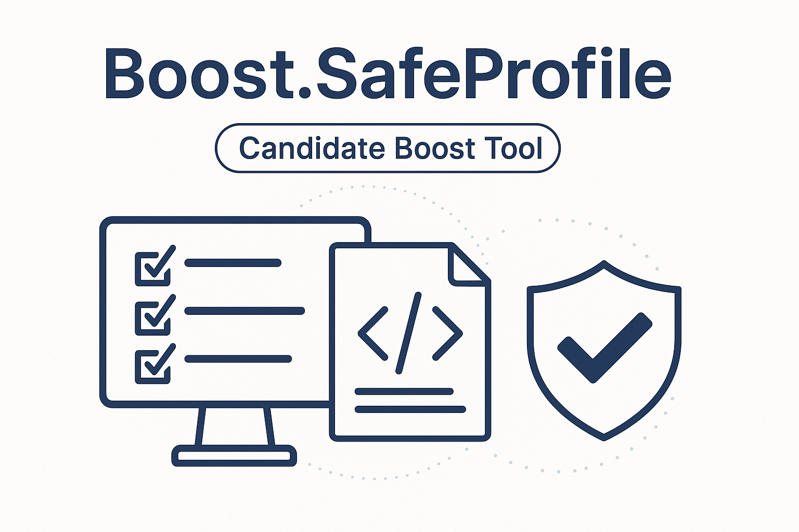
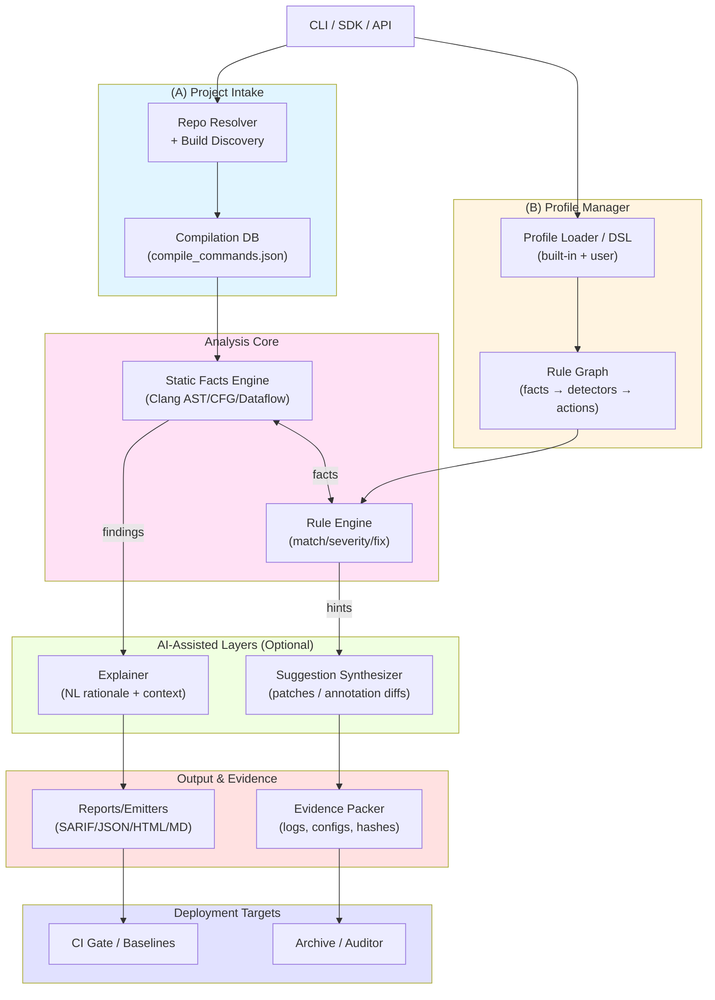

# Boost.SafeProfile



> **Status:** *Candidate Boost Tool* (proposed). This repository contains a developer-facing utility intended to support **WG21 Safety Profiles** adoption in C++ projects. See [`Requirements.md`](Requirements.md) for problem framing, audience, and scope.

---

## Overview

**Why**  
Modern C++ teams face sustained pressure to reduce memory-safety defects. WG21 is standardizing **Safety Profiles** (opt-in, tool-checked subsets of C++) so projects can claim stronger guarantees with evidence. Teams need practical help to (1) assess conformance, (2) reduce annotation debt, and (3) produce **auditable evidence packs** for CI and reviews.  
→ Full context in **[`Requirements.md`](./Requirements.md)**.

**Who**  
- Library authors (Boost and beyond) aiming for profile-clean libraries  
- Product teams needing a certifiable safety story without rewrites  
- Security/QA engineers verifying conformance  
- Tooling & standards contributors gathering empirical feedback

---

## What this tool does (short)

- **Analyze** a C++ codebase against a selected **Safety Profile** (WG21-aligned drafts or custom overlays)
- **Report** precise findings (rule id, severity, locations) + **human-readable explanations**
- **Suggest** minimal, non-destructive fixes (annotations, safer APIs)
- **Emit** a reproducible **Evidence Pack** (machine + human reports, tool fingerprints, optional sanitizer/fuzzer artifacts)
- **Gate** CI merges with deterministic exit codes and baselines
- **Ingest** repositories directly (local or remote) for a one-command start

> The tool itself adheres to a documented Safe C++ subset and ships its **own** conformance evidence (see “Self-Conformance”).

---

## Quickstart

**Current Status:** Tier 1 rules implemented (Ownership, Bounds, Type, Lifetime). See [Known Limitations](#known-limitations) below.

Analyze a local project:

```bash
build/boost-safeprofile ./path/to/project
```

Generate SARIF output for CI/IDE integration:

```bash
build/boost-safeprofile --sarif output.sarif ./path/to/project
```

Use a specific profile:

```bash
build/boost-safeprofile --profile memory-safety ./path/to/project
```

**For projects with system includes:** Generate and provide a `compile_commands.json`:

```bash
# In your project directory
cmake -DCMAKE_EXPORT_COMPILE_COMMANDS=ON -B build
cp build/compile_commands.json .

# Then analyze
boost-safeprofile ./path/to/project
```

**Self-test** (verify tool's own code is safe):

```bash
build/boost-safeprofile --sarif self-test.sarif src/
# Exit code 0 = clean, 1 = violations, 2 = compilation errors
```

---

## Typical Workflow

1. **Baseline:** run on main branch, archive evidence pack
2. **Harden:** apply low-risk suggestions (e.g., `std::span`, `not_null`, RAII)
3. **Gate:** add CI step with thresholds (e.g., "no blocker findings")
4. **Prove:** attach evidence packs to releases or audits

---

## Architecture

Boost.SafeProfile follows a modular pipeline architecture:



**Key Principles:**
- **Static-analysis-led** with optional AI assist (never AI-dependent)
- **Offline-first** design (no network access by default)
- **Deterministic** pipeline (same inputs → same outputs)
- **Modular** architecture with clear separation of concerns

For detailed component descriptions and design rationale, see **[`Design.md`](Design.md)**.

---

## CLI (high level)

```
boost-safeprofile analyze [REPO|PATH]
  --profile <name[@version]>     # select a Safety Profile (built-in or custom)
  --config  boostsafe.yaml       # project config (excludes, waivers, profile overlay)
  --offline | --online           # network policy (offline is default)
  --ai-explain --ai-suggest      # optional AI assistance layers
  --report  out/report.{html,md} # human-readable summary
  --sarif   out/findings.sarif   # machine-readable diagnostics
  --jsonl   out/findings.jsonl   # stream for pipelines
  --evidence out/evidence        # bundle for audits (zip directory)
  --baseline out/baseline.json   # establish/compare a baseline
  --fail-on blocker|major|any    # CI exit threshold
  --jobs    N                    # parallel analysis
```

See **`Requirements.md`** for intake, reporting, and evidence details.

---

## Profiles

- **Built-in drafts:** e.g., `core-safety`, `memory-safety` (WG21-aligned)  
- **Overlays:** add MISRA/AUTOSAR/CERT or org policies via YAML  
- **Pinned:** evidence packs include a `profile.lock.json` so audits are reproducible

Example overlay snippet (YAML):

```yaml
profiles:
  use: memory-safety@1.0.0
  disable:
    - SP-CAST-REINTERPRET
  enable:
    - SP-BOUNDS-CHECK-RECOMMENDED
```

---

## Outputs

- **SARIF / JSONL:** for code scanning and pipelines  
- **HTML / Markdown:** for human review (with code excerpts & explanations)  
- **Evidence Pack:** manifests, profile lock, tool fingerprints, findings, optional sanitizer/fuzzer logs, and reproducibility notes

Directory sketch:

```
out/
  findings.sarif
  findings.jsonl
  report.html
  evidence/
    manifest.json
    profile.lock.json
    toolchain.json
    findings.{sarif,jsonl}
    sanitizer/...
    fuzz/...
    configs/...
    reproducibility/{repro.md, cli.txt, env.txt}
```

---

## CI Integration

Minimal GitHub Actions step:

```yaml
- name: Safety Profile analysis
  run: |
    boost-safeprofile analyze --profile memory-safety \
      --sarif findings.sarif --evidence evidence \
      --fail-on blocker .
- name: Upload SARIF
  uses: github/codeql-action/upload-sarif@v3
  with:
    sarif_file: findings.sarif
```

**Exit codes:** `0` (clean or below threshold), non-zero otherwise.  
**Baselines:** pin a baseline file and compare deltas per PR.

---

## Configuration

Create `boostsafe.yaml` in repo root to keep commands short:

```yaml
project:
  root: .
  excludes: [ "build/**", "third_party/**" ]
intake:
  respect_gitignore: true
profiles:
  use: core-safety@1.0.0
ci:
  fail_on: blocker
  offline: true
reports:
  sarif: out/findings.sarif
  html:  out/report.html
  evidence_dir: out/evidence
```

Run:

```bash
boost-safeprofile analyze --config boostsafe.yaml
```

---

## Self-Conformance

This tool “eats its own cooking”:

- Built under a documented **Safe C++** subset (no owning raw pointers, RAII, bounds-checked access, safe concurrency)
- Release artifacts include the tool’s **own evidence pack** (`evidence/self/…`)
- CI runs **ASan/UBSan/TSan** and **coverage-guided fuzzing** on input handlers
- Static analysis and warnings-as-errors are release blockers

---

## Project Scope & Positioning

- Distributed under the **Boost Software License**  
- Lives alongside other **Boost developer tools** (not a runtime library you link)  
- Aims to **support** WG21 Safety Profiles adoption with analysis, guidance, and auditable evidence  
- **AI-assisted**, not AI-dependent: runs fully offline with deterministic fallbacks

---

## Known Limitations

**Current Version:** Tier 1 rules implemented (v0.4.0-dev)

### What Works ✅
- Self-contained C++ code (no system includes)
- Detects 5 core safety violations:
  - SP-OWN-001: Naked new expression
  - SP-OWN-002: Naked delete expression
  - SP-BOUNDS-001: C-style array declaration
  - SP-TYPE-001: C-style cast
  - SP-LIFE-003: Return reference to local variable
- AST-based semantic analysis (no false positives in comments/strings)
- SARIF 2.1.0 output
- Explicit compilation error reporting
- compile_commands.json support (infrastructure in place)

### Known Gaps ⚠️
1. **System Include Resolution:** Files with `#include <memory>` may fail to compile even with compile_commands.json
   - **Workaround:** Use compilation databases from actual CMake projects
   - **Status:** Infrastructure complete, refinement needed

2. **Limited Rule Coverage:** Only 5 rules implemented (18+ planned)
   - See [RULES-ROADMAP.md](RULES-ROADMAP.md) for expansion plan

3. **No Git/Remote Repository Support:** Local directories only (planned for Phase 1.x)

4. **No HTML Reports:** SARIF output only (HTML generator planned)

5. **No AI Assistance:** Deterministic analysis only (AI layers planned for v1.x)

6. **No Evidence Packs:** SARIF only (full evidence bundles planned)

### Not Tested Yet 🔍
- Template metaprogramming edge cases
- Heavy macro usage
- Cross-compilation scenarios
- Windows platform (macOS/Linux only so far)

**See [RED-TEAM-SPRINT-1.md](RED-TEAM-SPRINT-1.md) for detailed test results.**

---

## Roadmap

### Completed
- ✅ v0.1.0: AST-based detection, SP-OWN-001 (naked new)
- ✅ v0.2.0: SP-OWN-002 (naked delete)
- ✅ v0.3.0: SP-BOUNDS-001 (C-style arrays)
- ✅ v0.4.0: SP-TYPE-001 (C-style casts), SP-LIFE-003 (dangling refs)

### Next (v0.5.0+)
- Tier 2 rules expansion (ownership, bounds, type safety)
- CI/CD integration (GitHub Actions)
- Real-world project testing
- HTML report generation

### Future (v1.0+)
- Complete WG21 Safety Profile coverage
- Git repository support
- Evidence pack generation
- Optional AI assistance layers
- Editor/IDE integration

(Exact milestones tracked in issue tracker.)

---

## Contributing

Contributions welcome—especially on:
- Rule detectors & profile packs  
- Emitters (reports, dashboards)  
- Large-repo performance & incremental analysis  
- Documentation and examples

Please see `CONTRIBUTING.md` (to be added) and discuss proposals via issues before large PRs.

---

## License

Boost Software License 1.0. See `LICENSE` for details.

---

## Acknowledgments

This candidate tool builds on community work around **WG21 Safety Profiles**, the **C++ Core Guidelines**, and long-standing Boost practices that encourage safer C++.
